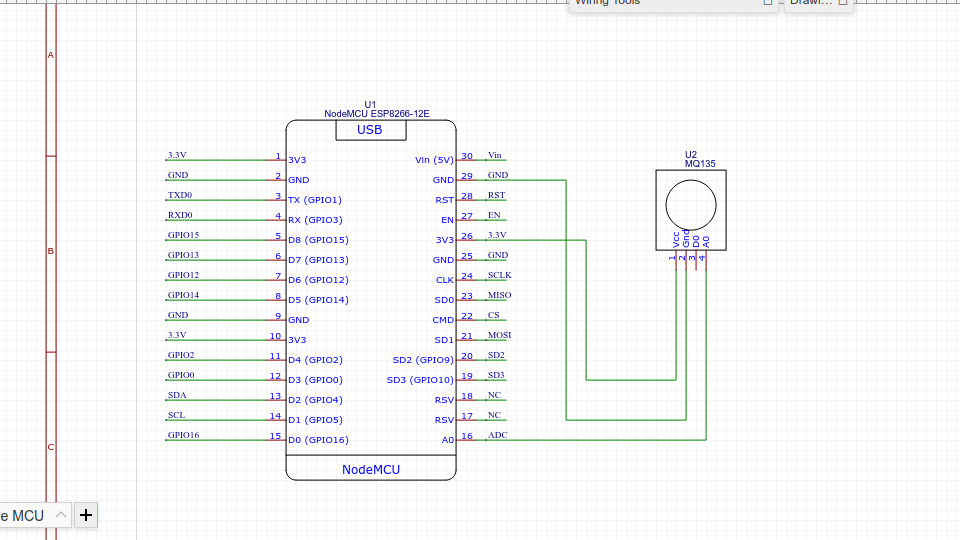

# CO2 level monitoring using MQ135 and ESP8266

This solution uses MQ135 sensor for mesuring CO2 level. 
The code is written in micropython and the library for MQ135 sensor is downloaded separately.
Library link: [click here](https://github.com/rubfi/MQ135.git)

For better undestanding, I have included the code in mq135.py.

## Circuit diagram

